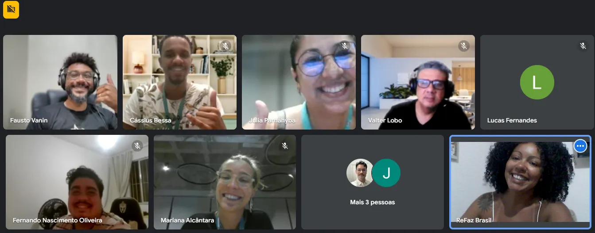

# Blockchain na Escola at 42 Rio

## General Overview

The **Blockchain na Escola** program joined forces with **42 Rio** to foster a new wave of education and social impact through Web3 and blockchain technologies. The initiative took place through a series of events, including an institutional talk and a hands-on workshop titled **"Mão na Massa"** — guiding students from beginner level to the practical application of blockchain in just 10 days.

## Program Goals

### General Objective
Promote the *Blockchain na Escola* program, showcase its social and educational impact, and establish a strategic partnership with 42 Rio to empower students with Web3 and blockchain skills.

### Specific Objectives
- Share the educational and social impact of the Blockchain na Escola program with the academic community.
- Engage 42 Rio students in Web3 opportunities and its transformative career potential.
- Establish ongoing collaboration between Blockchain na Escola and 42 Rio.
- Encourage real-world blockchain project involvement by 42 Rio students.

## Value Proposition

Participation in the event provides an inspiring and hands-on perspective on the transformative power of blockchain and emerging career paths in Web3. The partnership opens pathways for 42 Rio students to participate in real blockchain projects driven by the Blockchain na Escola program in 2025.

## Deliverables

### Inspirational Talk: *"Careers and Impact in Web3"*
- **Speaker**: Luciana Sousa
- **Topics**:
  - What is Web3 and why it matters
  - Career paths in blockchain
  - Social and economic impact of Web3
  - Success stories from Blockchain na Escola

### Institutional Presentation
- Overview of the program
- Measurable social and educational impact
- Sample projects and initiatives
- Partnership proposal with roadmap

### Engagement Kit (Digital)
- E-book on Web3 fundamentals
- Learning tools and blockchain platforms
- Web3 career tips and resources

### Networking & Follow-up
- Invitation to future Blockchain na Escola activities
- Social media engagement and updates

## Implementation Stages

### 1. Pre-Event Planning
- Coordination with 42 Rio event team
- Preparation of talk and institutional materials
- Promotion of the program within the 42 Rio community

### 2. Event Execution
- Delivery of the talk *“Careers and Impact in Web3”*
- Program presentation and interaction with students

### 3. Post-Event
- Distribution of engagement materials
- Creation of follow-up channels for interested students
- Scheduling of strategic meetings for partnership development

## Expected Benefits

### For Blockchain na Escola
- Expansion of the impact network
- New strategic partnerships
- Visibility within the innovation ecosystem

### For 42 Rio
- Student access to a booming tech area
- Motivation to explore new career opportunities
- Practical learning experiences in blockchain

### For Students
- Clear understanding of Web3 potential
- Career inspiration and professional development
- Contact with experienced professionals and cutting-edge tools

## Workshop Proposal: 42 Rio x Blockchain na Escola

### Theme
**Combating Dropout and Boosting Engagement at 42 Rio Through Gamified Blockchain Solutions**

### Objective
Deliver a hands-on workshop to empower cadets to design a blockchain network and build engagement tools such as token systems, airdrops, and gamified activity tracking via DAO governance.

### Context
Based on the existing **Orbit Alliance** project developed by 42 Rio (whitepaper available upon request).

## Target Audience

- **Participants**: 10 active cadets
- **Observers**: 50 students
- **Duration**: 20 hours (10 days, 2 hours/day)
- **Dates**: January 20–31, 2025
- **Format**: Online

## Workshop Content Overview

### Covered Topics
- Blockchain fundamentals
- Smart contracts
- Token creation and airdrops
- Gamification strategies
- DAO governance

## Workshop Schedule

### Day 1 — Introduction & Fundamentals  
**Mentor**: Valter Lobo  
- Blockchain basics and the role of decentralization
- Web3 tools overview + Solidity intro  
- Presentation of the engagement and dropout challenge  

### Day 2 — Practice: Setting Up a Blockchain  
**Mentor**: Valter Lobo  
- Building a local blockchain simulation  
- Simple transaction tests  

### Day 3 — Practice: Smart Contracts & Wallets  
**Mentor**: Valter Lobo  
- Smart contract deployment on Celo  
- Wallet setup and testing  

### Day 4 — Tokenization Concepts  
**Mentor**: Fausto Vanin  
- Token types and use cases  
- Airdrop mechanics for engagement  

### Day 5 — Practice: Token Development  
**Mentor**: Fausto Vanin  
- ERC-20, 721, and 1155 standards  
- Token deployment in custom network  

### Day 6 — Practice: DApp + Airdrops  
**Mentor**: Fausto Vanin  
- Building a basic DApp  
- Airdrop execution and claiming interface  

### Day 7 — UX for Web3  
**Mentor**: Solange Soledad  
- UX design in decentralized environments  
- Gamified interaction planning  

### Day 8 — Gamification Lecture  
**Speaker**: Helô Passos  
- Gamified mission systems  
- Metrics and user engagement strategies  

### Day 9 — DAO Governance  
**Mentor**: Gabriella Mena  
- DAO concepts and tools  
- Building a basic governance system  

### Day 10 — Final Presentation & Certification  
**Mentor**: Luciana Sousa  
- Project showcase  
- Feedback round  
- NFT certificate delivery  

## Resources Required

- Internet-connected computers  
- Meeting room access (Zoom/Meet)  
- Telegram groups for support  
- Web3 tools (e.g., MetaMask, Remix IDE)  
- Mentorship from blockchain experts  
- NFT certificates for completion  

## Report: *Hands-On Blockchain Workshop*

### Strategic Opportunity
On **December 12, 2024**, the Blockchain na Escola program joined 42 Rio's institutional event, presenting a panel on careers in Web3. The talk drew major interest, leading to **22 student signups** for the workshop **"Mão na Massa"**, held in **February 2025**. The partnership included access to 42 Rio’s physical infrastructure for future events.

### Workshop Structure
- Exclusive group: 10 Orbit Project cadets  
- Duration: 7 days  
- Focus: From fundamentals to real-world blockchain applications  

### Data & Results
Initial assessment: 100% of participants reported **low prior knowledge** of Web3.  
Final outcome: Students applied skills in the **Modular Carnival Hackathon**, earning **2nd place**, validating the methodology.

## Key Milestones

- Panel presentation at 42 Rio event (Dec 2024)  
- Conversion of 22 attendees to workshop  
- Execution of "Mão na Massa" in Feb 2025  
- Real-world blockchain projects development  
- Strategic partnership established with 42 Rio  

## Execution

- **Mentors**:  
  - Fausto Vanin (Tokenization)  
  - Valter Lobo (Smart Contracts)  
  - Helô Passos (Gamification)  
  - Luciana Sousa (Coordinator & Lead Instructor)  

> All investment was directed to expert mentoring, coordination, and resource access to ensure high-quality learning.

